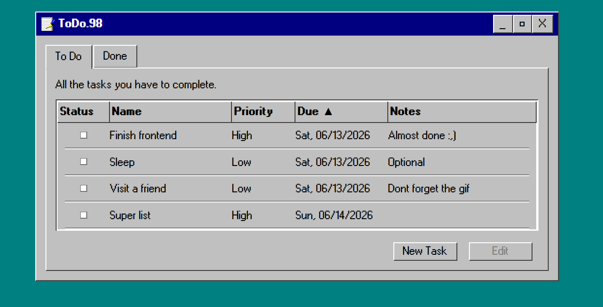
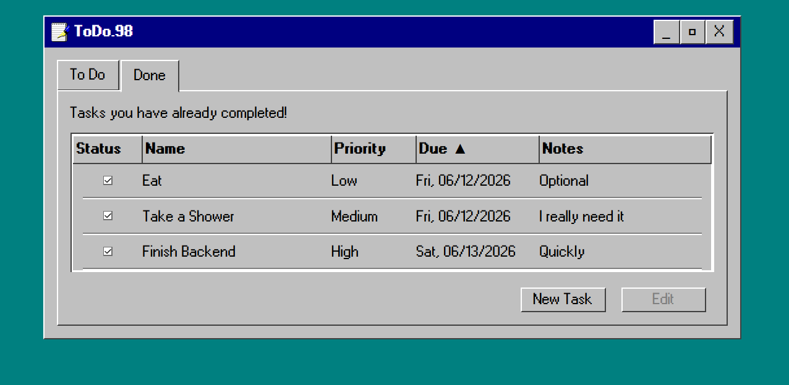
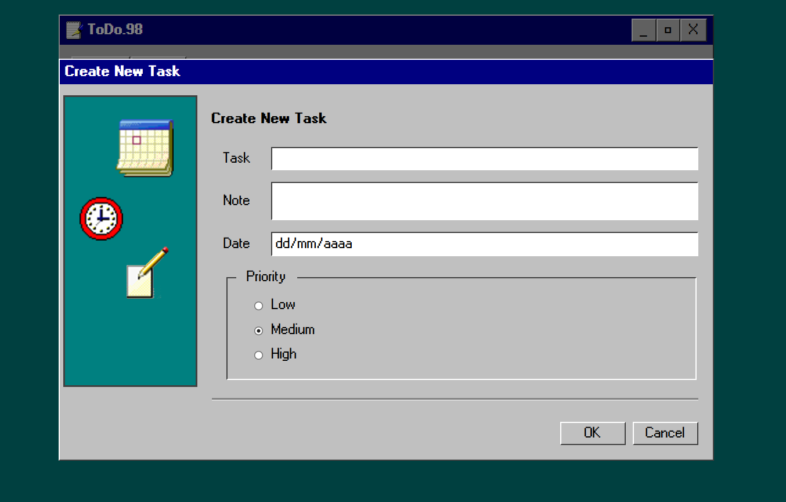
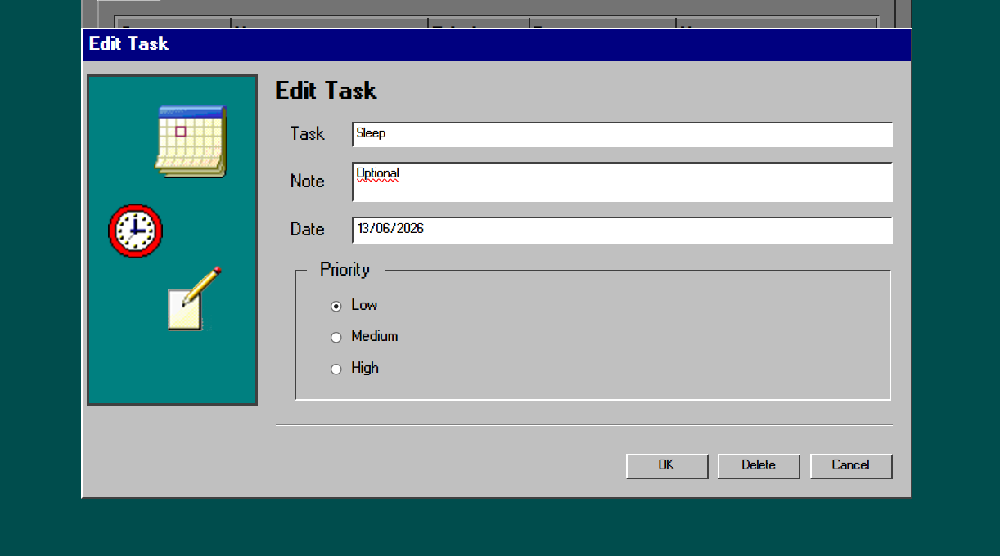

# 📝 Todo App

A full-stack task management application built with React, TypeScript, and ASP.NET Core Web API.

This project allows users to create, update, delete, and manage tasks through a Windows 98-inspired user interface while consuming a RESTful backend API.

---

## 🚀 Features

- Create new tasks
- Edit existing tasks
- Delete tasks
- View all tasks
- Filter tasks by status
- Responsive task table
- Windows 98 inspired UI
- REST API integration
- SQLite database persistence

---

## 🛠️ Tech Stack

### Frontend
- React
- TypeScript
- Vite
- CSS

### Backend
- ASP.NET Core Web API
- Entity Framework Core
- SQLite

### Tools
- Git
- GitHub

---

## 📁 Project Structure

```text
TodoApp/
├── TodoApp.API/
│   ├── Controllers/
│   ├── Models/
│   ├── Data/
│   └── Program.cs
│
├── TodoApp-client/
│   ├── src/
│   ├── public/
│   └── package.json
│
├── .gitignore
└── README.md
```

---

## ⚙️ Getting Started

### Clone the repository

```bash
git clone https://github.com/YOUR_USERNAME/YOUR_REPOSITORY.git
cd TodoApp
```

---

### Backend Setup

Navigate to the API project:

```bash
cd TodoApp.API
```

Restore dependencies:

```bash
dotnet restore
```

Run the API:

```bash
dotnet run
```

The API will be available at:

```text
https://localhost:5001
```

or

```text
http://localhost:5000
```

depending on your local configuration.

---

### Frontend Setup

Open a new terminal:

```bash
cd TodoApp-client
```

Install dependencies:

```bash
npm install
```

Start the development server:

```bash
npm run dev
```

The application will be available at:

```text
http://localhost:5173
```

---

## 🔌 API Endpoints

| Method | Endpoint | Description |
|----------|----------|----------|
| GET | /api/todos | Retrieve all tasks |
| GET | /api/todos/{id} | Retrieve a task by ID |
| POST | /api/todos | Create a new task |
| PUT | /api/todos/{id} | Update an existing task |
| DELETE | /api/todos/{id} | Delete a task |

---

## 🎨 User Interface

The application features a retro Windows 98-inspired design, including:

- Classic window styling
- Custom title bars
- Retro buttons and controls
- Pixel-style typography
- Vintage desktop-inspired layout

---

## 📸 Screenshots

### Task List



### Create Task



### Edit Task



---

## 💡 Technical Highlights

- Built using a client-server architecture
- RESTful API communication
- State management with React Hooks
- Entity Framework Core data access
- SQLite local database
- Modular component-based frontend structure
- Strong typing with TypeScript

---

## 👩‍💻 Author

**Isis Flores**

Developed as a Full Stack technical assessment project using React and ASP.NET Core.
